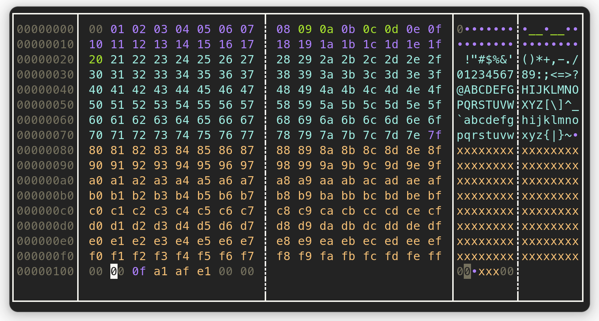

# Hextazy

A coloful __hexadecimal editor__, inspired by [hexyl](https://github.com/sharkdp/hexyl).



## Build

```bash
git clone https://github.com/0xfalafel/hextazy.git
cd hextazy
cargo build
```

## Install

An amd64 linux binary is available: [https://github.com/0xfalafel/hextazy/releases/latest/](https://github.com/0xfalafel/hextazy/releases/latest/).

You can also install via `cargo`:

```bash
git clone https://github.com/0xfalafel/hextazy.git
cargo install --path ./hextazy
```

If you don't have `cargo` installed. There are installation instructions here [https://doc.rust-lang.org/cargo/getting-started/installation.html](https://doc.rust-lang.org/cargo/getting-started/installation.html).

## Usage

`hextazy` take the file to edit as an argument.

```
Usage: hextazy [file]
```

```bash
hextazy ./test/all_bytes.bin
```

You can edit the file directly. Use `Tab` to switch between the Hexdecimal and Ascii editors.

Once you're done, press __`q`__ or __`Ctrl + C`__ to __exit__.

## Shortcuts

| Key Combination   | Action       |
|-------------------|--------------|
| `Ctrl + C`        | Exit the app without saving. |
| `Ctrl + Q`        | __Exit__ the app. |
| `q`               | Exit the app (in _hex editor_ mode). |
| `Ctrl + Z`        | __Undo__ the last write. |
| `Ctrl + Y`        | __Redo__, cancel the last _undo_. |
| `Ctrl + U`        | __Undo all__ changes. |
| `Backspace`       | __Move left__ / __Undo__ the modification of the __previous byte__. |
| `Ctrl + →`        | Jump 4 bytes to the right. |
| `Ctrl + ←`        | Jump 4 bytes to the left. |
| `Tab`             | Switch between _ascii_ and _hexadecimal_ editor mode. |
| `:`               | Open the command bar. |
| `Esc`             | Close the command bar. |
| `/`               | Open the search bar. |

### Search

| Key Combination   | Action       |
|-------------------|--------------|
| `/4142`           | Search the hex value `0x4142`, and the ascii string `"4142"`. |
| `n`               | Go to the next search result. |
| `Shift + n`       | Go to the previous search result. |
| `:s/abc`          | Search the _string_ `"acb"`. |
| `:x/4142`         | Search the hex value `0x4142`. |
| `:xi/4142`        | Search the hex value in reverse order: `0x4241`. |

### Commands

The command bar is opened with `:` in the _hexadecimal editor_ mode.

| Command           | Action       |
|-------------------|--------------|
| `:`               | Open the command bar. |
| `:q`              | Close the app. |
| `:0x1234`         | Jump at the address `0x1234`. |
