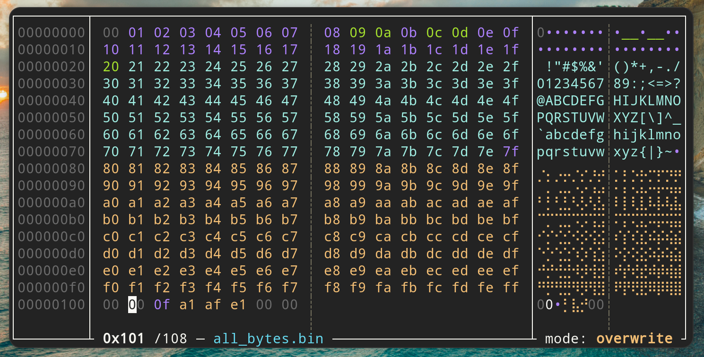

# Hextazy

A coloful __hexadecimal editor__, inspired by [hexyl](https://github.com/sharkdp/hexyl).



## Build

```bash
git clone https://github.com/Faelian/Hextazy.git
cd Hextazy
cargo build
```

## Install

An amd64 linux binary is available: [https://github.com/Faelian/Hextazy/releases/latest/](https://github.com/Faelian/Hextazy/releases/latest/).

You can also install via `cargo`:

```bash
git clone https://github.com/Faelian/Hextazy.git
cargo install --path ./Hextazy
```

If you don't have `cargo` installed. There are installation instructions here [https://doc.rust-lang.org/cargo/getting-started/installation.html](https://doc.rust-lang.org/cargo/getting-started/installation.html).

## Usage

`hextazy` take the file to edit as an argument.

```
Usage: hextazy [file]
```

```bash
hextazy ./test/all_bytes.bin
```

You can edit the file directly. Please note that there is __no undo__ at the moment.

Once you're done, press __`q`__ to __exit__.