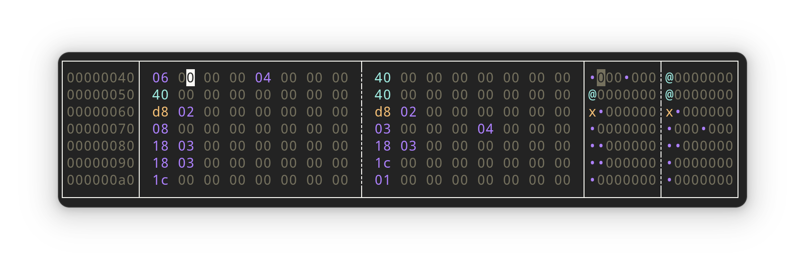

# Architecture

This document is here to provide a _high-level_ view of how the code is organised.
It should make it easier to understand _where_ a modification is supposed to be done. What part of the code will be responsible for a functionnality.

## File overview

### `main.rs`

The following functions are part of main:

- Handling of the command line arguments given to the programm.
- Initialization of _ratatui_ and __restoring the terminal__ when exiting the application.
- Handling of __all keyboard shortcuts__ in the main loop of application.

### `app.rs`

`app.rs` is the heart of the application. The `struct App` keep track of all the important _handles on files_, _BufReader_ and data structures.

#### Important variables

2 variables that are referenced everywhere in the code are our 2 __"cursors"__ :

- __`offset`__: indicate where our _view of the bytes_ start.

For example, if the app show the following interface, `offset = 0x40`.
Note that `offset` is always a multiple of `0x10`.

- __`cursor`__: indicate the __position of the cursor__ of the app, but there is a trick to it.
All the bytes are represented by 2 character, i.e `0xde` is composed of `d` and `e`. The `cursor` indicate which _half-byte_ is pointed.

> In the illustration bellow, our `cursor` is in the _second half_ of the byte `0x41`. So our `cursor` value is `0x41 * 2` + `1` _half-byte_. `cursor = 0x83`.

__One trick__ use trough the code to find _the address_ of the byte pointed by the cursor is to _divide cursor by 2_.

> In the illustration bellow, to find the __offset__ of the __byte pointed by cursor__. `0x83 / 2 = 0x41`. 

- `reader` is a [BufReader](https://doc.rust-lang.org/std/io/struct.BufReader.html) that is used to read the content of the file edited.

### `ui.rs`

`ui.rs` contains all the code related to the construction of the _ui_ with _ratatui_.

The __`ui()` create__ all the __ui__ using the data from the __`App` data structure__.

First we have the declaration of the `constraints`. Then the creation of the 3 blocks:

- `address_block`, 
- `hex_block`
- `ascii_block`

Then `ui()` create the eventual _pop-ups_ that can appear:

- the `command bar`
- `error message`s 
- the `exit_popup`

### `search.rs`

All the code related to the __search functions__ is in `search.rs`.

Note that the __parsing__ of the `command`/`search` is in `app.rs` in the `interpret_command()` function.

## Main strategies

__All the modifications__ made are stored in the _HashMap_ `app.modified_bytes`. 
The modifications can eventualy be written to the file using the `save_to_disk()` function.

## Important functions

Some functions are called a lot through the code.

Functions to move our _display_ relative to our actual position.

- `change_offset(&mut self, direction:i64)`: move the `app.offset`. The _window_ if you prefer.
- `change_cursor(&mut self, direction:i64)`: move the `app.cursor`.

Functions to move our _display_ to an arbitrary address.

- `jump_to(&mut self, new_address: u64)`: move the `cursor`, and the _display_ to the address given.
- `cursor_jump_to(&mut self, new_cursor_address: u64)`: __same__ but we can control on which _half-byte_ we arrive.
